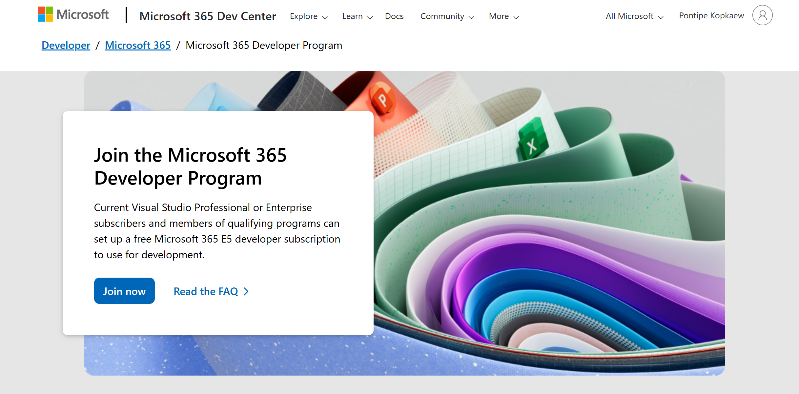
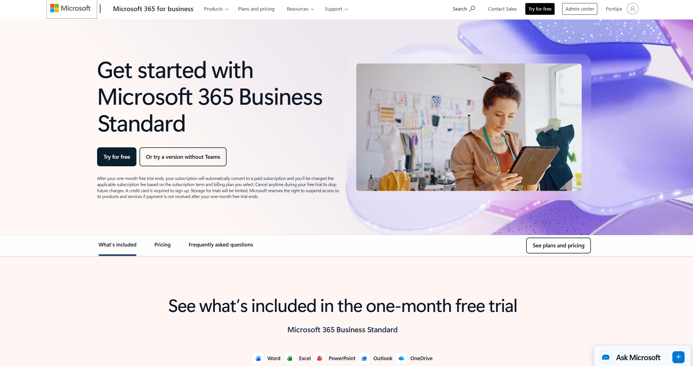
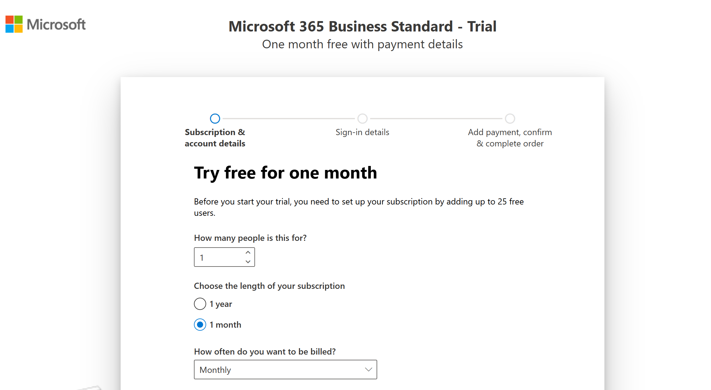

# Microsoft 365 Admin Skills Lab — User & Identity Management

 
A hands-on lab documenting real Microsoft 365 admin tasks performed using a **Microsoft 365 Business Standard free trial**. This project demonstrates practical IT admin skills relevant to Help Desk, IT Support, and Cybersecurity Analyst roles.

 
---
 
## 🛠️ Environment
 
| Tool | Details |
|------|---------|
| Platform | Microsoft 365 Admin Center (`admin.microsoft.com`) |
| Access Method | Microsoft 365 Business Standard — Free Trial ✅ *(used in this lab)* |
 
---
 
## 🔑 How to Get Access to Microsoft 365 Admin
 
There are two free ways to get access to the M365 Admin Center for practice:
 
### Option 1 — M365 Developer Sandbox (Free, 90 days)
Best for developers and IT learners who want a pre-configured environment with 25 user accounts.
- Sign up at: [developer.microsoft.com/microsoft-365/dev-program](https://developer.microsoft.com/microsoft-365/dev-program)
- Gives you a free E5 sandbox tenant with 25 users and full admin access
- Renews automatically as long as you stay active

### Option 2 — Microsoft 365 Business Standard Free Trial ✅ *(used in this lab)*
Best for simulating a real business environment from scratch.
- Sign up at: [microsoft.com/microsoft-365/business/compare-all-plans](https://www.microsoft.com/microsoft-365/business/compare-all-plans)
- 30-day free trial, no commitment required
- Includes full access to the M365 Admin Center, Outlook, OneDrive, and Teams
- You set up your own tenant and users, which mirrors real-world IT onboarding

---

## 📋 Skills Demonstrated
 
- User lifecycle management (create, modify, disable, delete)
- License assignment and management
- Group membership and access control
- Password reset and account recovery
- OneDrive sharing permissions and storage settings
- Outlook and Teams admin configuration
- Identity and access management (IAM) fundamentals
---

## 📁 Tasks

| # | Task | Folder |
|---|------|--------|
| 1 | Create a new user and assign a license | [`create-user-assign-license/`](./create-user-assign-license/) |
| 2 | Reset a user's password | [`reset-users-password/`](./reset-users-password/) |
| 3 | Add a user to a group | [`add-user-to-group/`](./add-user-to-group/) |
| 4 | Disable and delete a user (offboarding) | [`delete-user/`](./delete-user/) |
| 5 | Access Outlook, OneDrive, and Teams settings from the admin panel | [`outlook-onedrive-teams-settings/`](./outlook-onedrive-teams-settings/) |
| 6 | Change sharing permissions on a OneDrive folder | [`onedrive-sharing-permissions/`](./onedrive-sharing-permissions/) |

Each folder contains:
- `notes.md` — step-by-step walkthrough of what was done and what was learned
- Screenshots of key actions and results
---
 
## 🔐 Relevance to IT & Cybersecurity
 
These tasks directly map to real-world responsibilities in IT support and cybersecurity:
 
- **User provisioning and deprovisioning** is a critical part of the identity lifecycle and access control
- **License management** ensures users only have access to what they need (principle of least privilege)
- **Password resets** are among the most common help desk tickets
- **OneDrive sharing permissions** relate to data loss prevention (DLP) and insider threat mitigation
- **Group-based access control** is foundational to role-based access control (RBAC)
---
 
## 📸 Screenshots
 
All screenshots are stored in the [`screenshots/`](./screenshots/) folder and referenced within each task's `notes.md`.
 
---

## Resources

> *This lab was built as part of an ongoing effort to develop hands-on IT admin and cybersecurity skills beyond the classroom.*