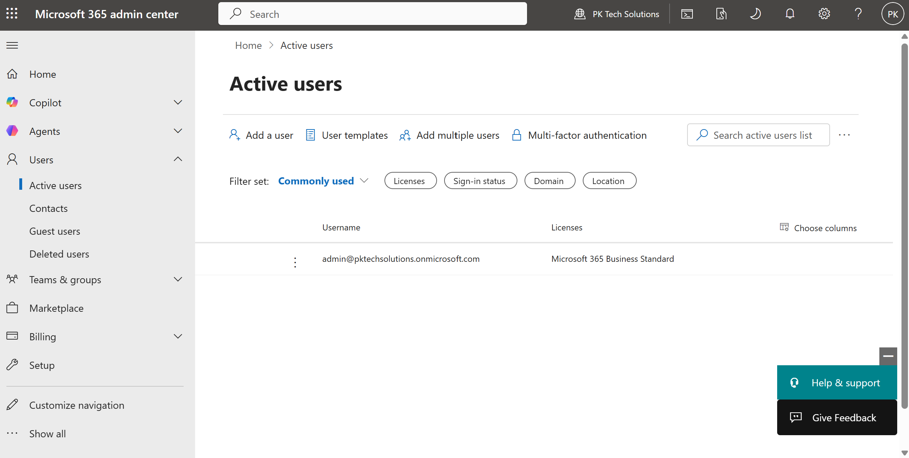
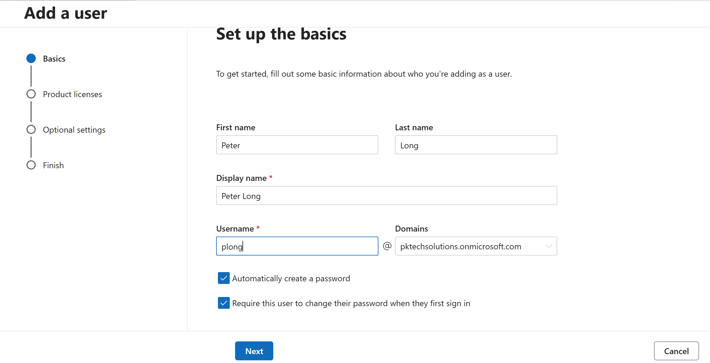
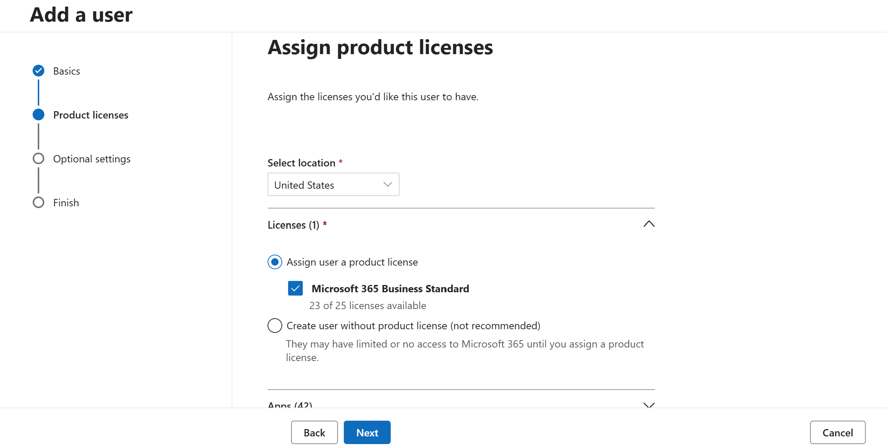
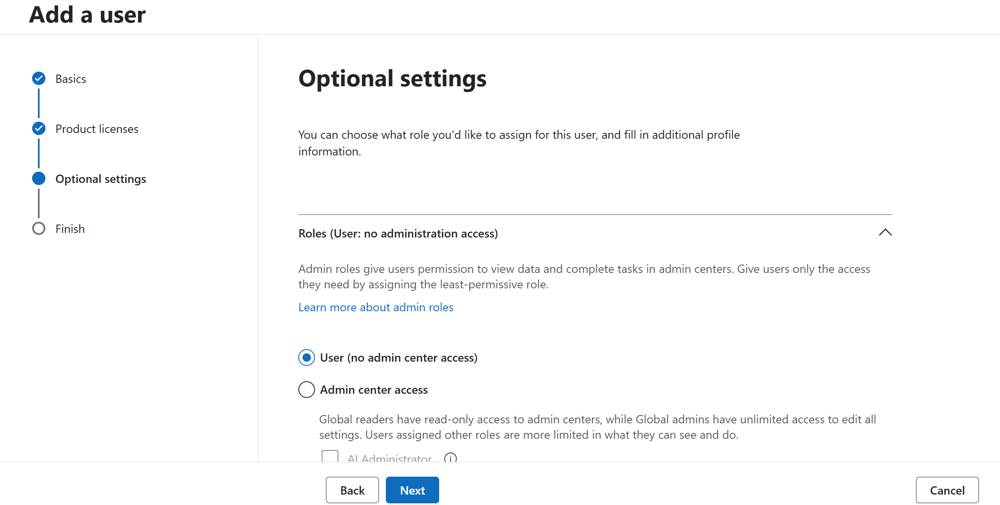
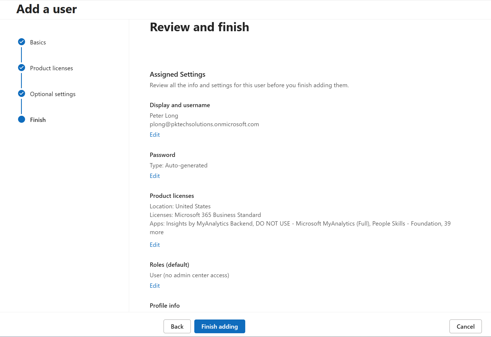
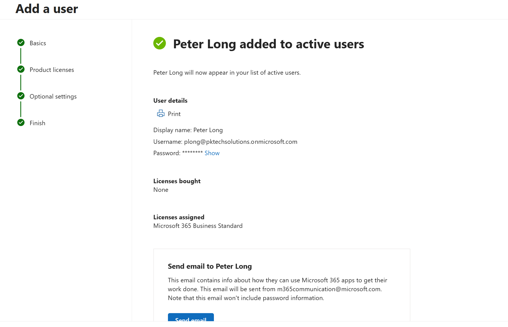

## Task: Create a New User and Assign a License

### Goal
Add a new user to the M365 tenant and assign them a Microsoft 365 license.

### Steps taken
1. Logged into admin.microsoft.com
2. Navigated to Users > Active Users > Add a user
3. Filled in name, username, and password settings
4. Assigned a Microsoft 365 E5 license
5. Confirmed the user appeared in Active Users

### Screenshots

  

  

  

  

  

  

  

### What I learned
Assigning licenses controls what apps and services a user can access. 
Without a license, the account exists but the user can't use M365 services.