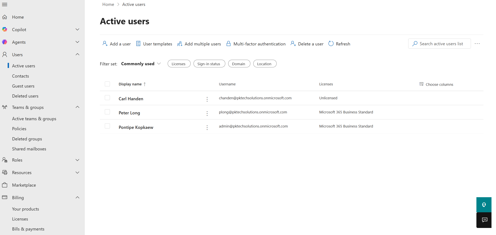
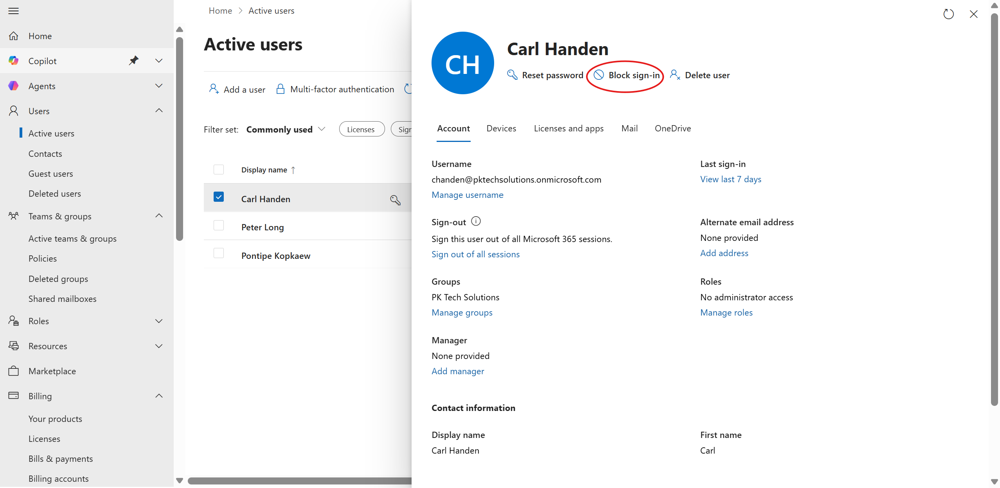
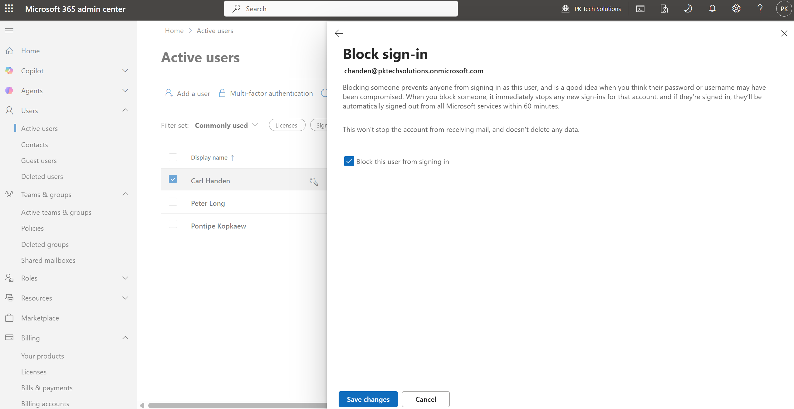
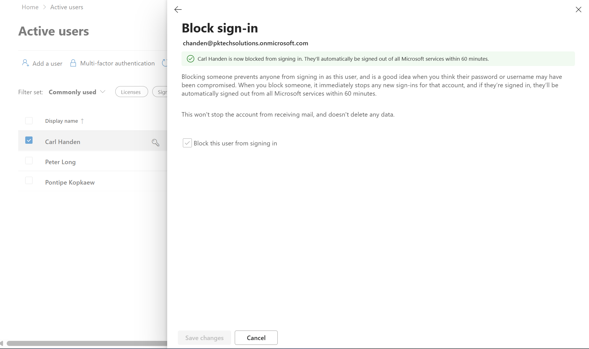
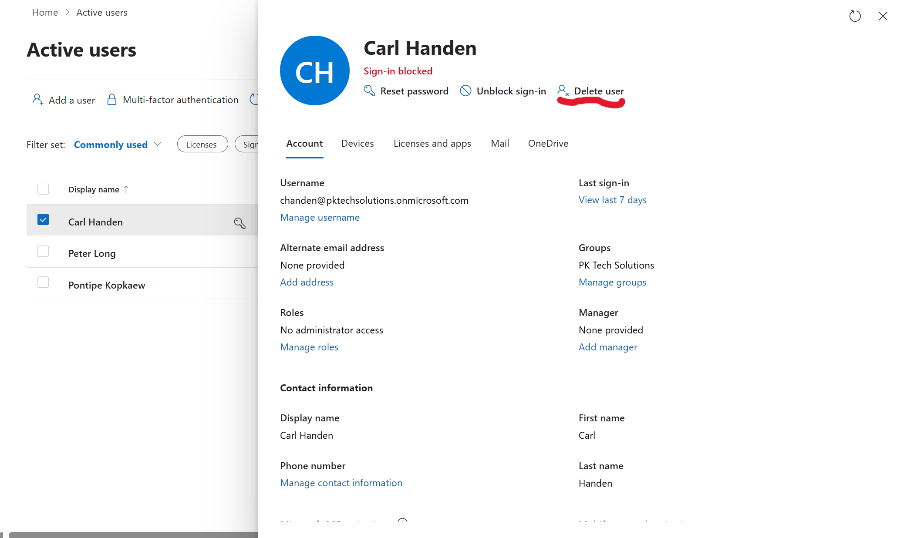
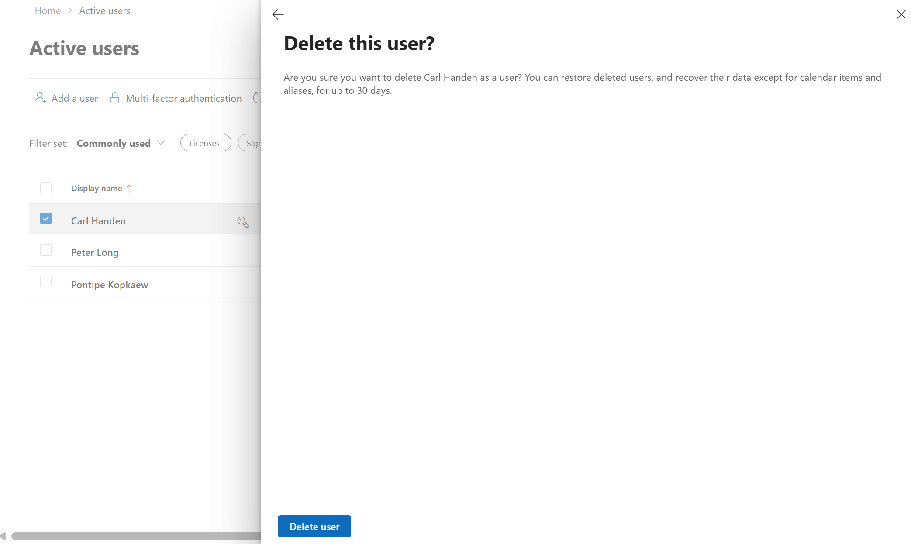
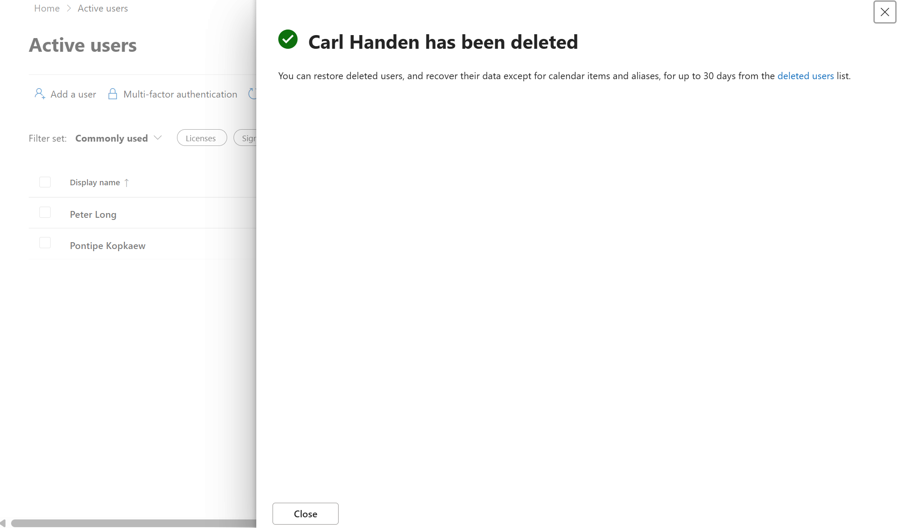
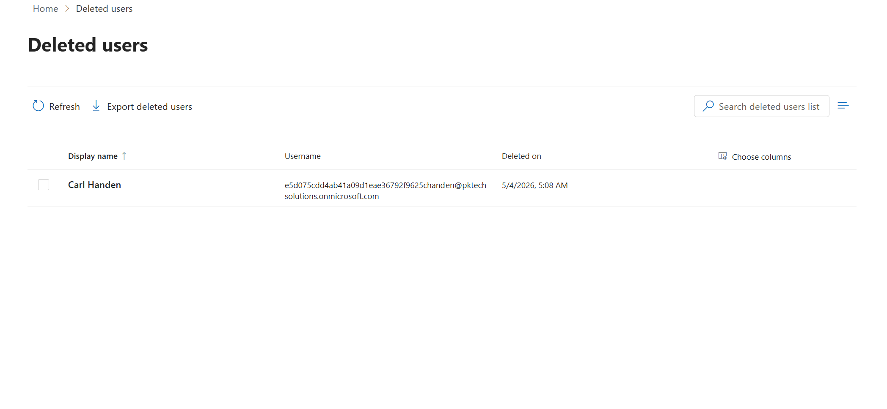

## Task: Disable and delete a user (offboarding)

### Goal
Simulate the offboarding process by disabling and then deleting a user account.

### Steps taken
1. Logged into admin.microsoft.com
2. Navigated to Users > Active Users
3. Selected user
4. Clicked Block sign-in to immediately disable their access while preserving their account and data
5. Confirmed the account showed a blocked status in Active Users
6. Navigated to Users > Deleted users after deletion
7. Selected the user and clicked Delete user permanently

### Screenshots

  

  

  

  

  

  

  

  

### What I learned
Proper offboarding is critical for security. Blocking sign-in first gives IT time to back up data or reassign resources before permanent deletion. Deleted accounts are held for 30 days in M365 before being permanently removed, which allows for recovery if needed.