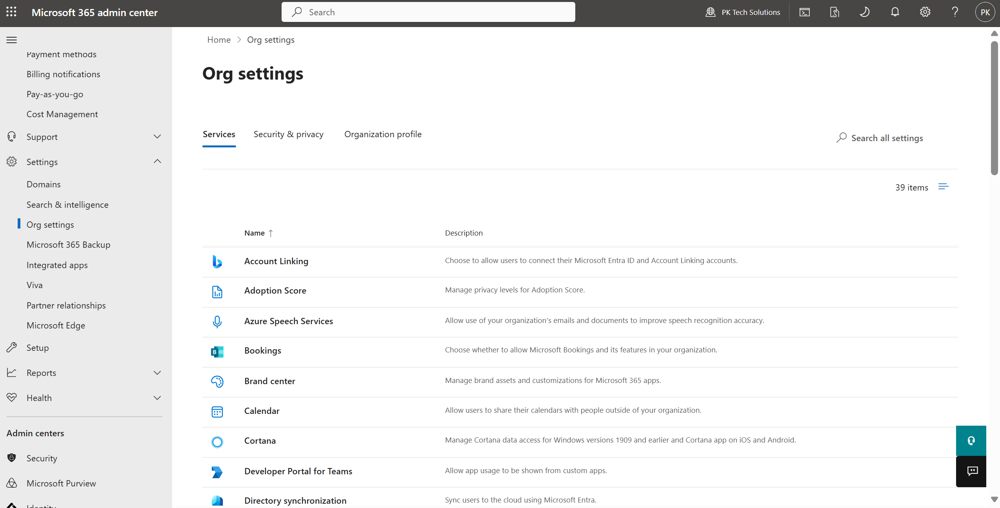
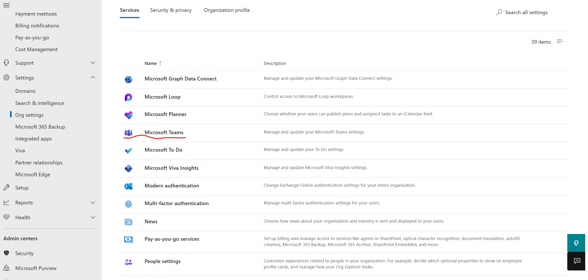
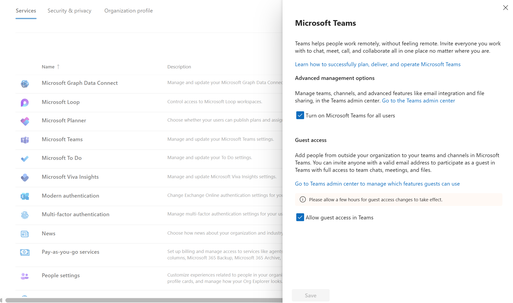
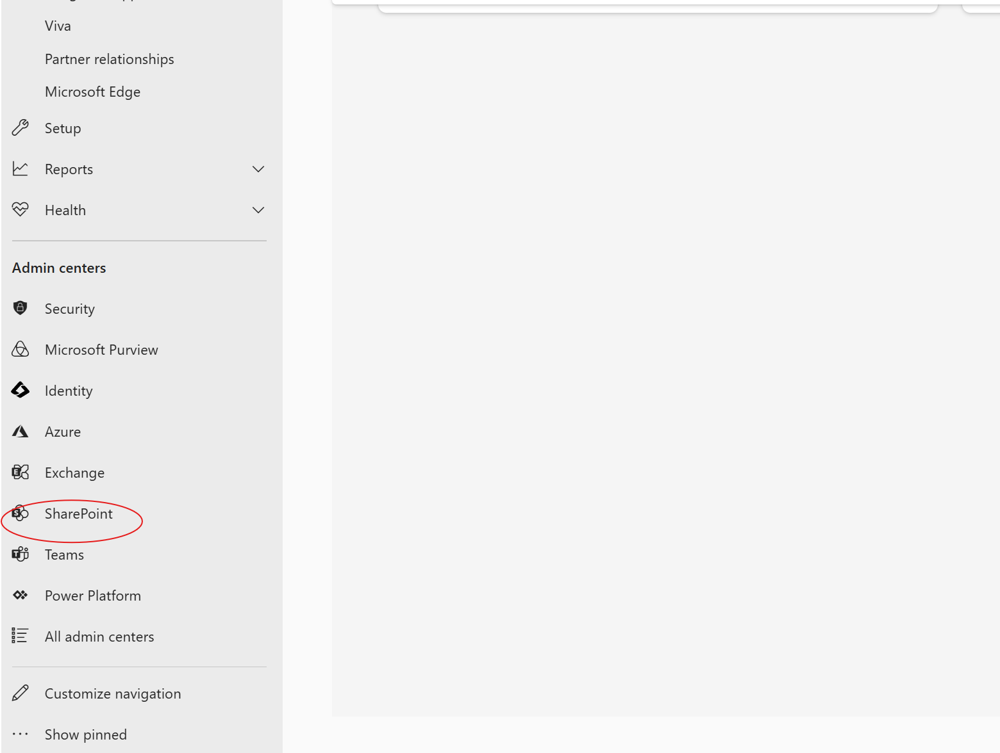
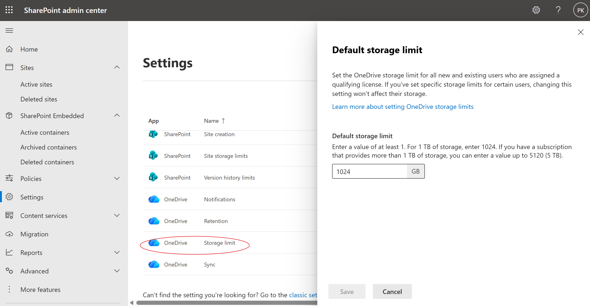
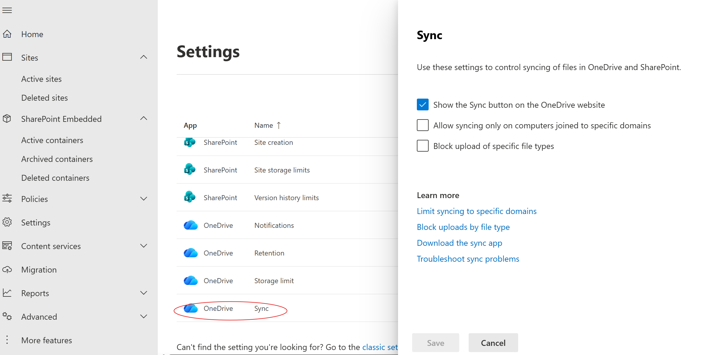
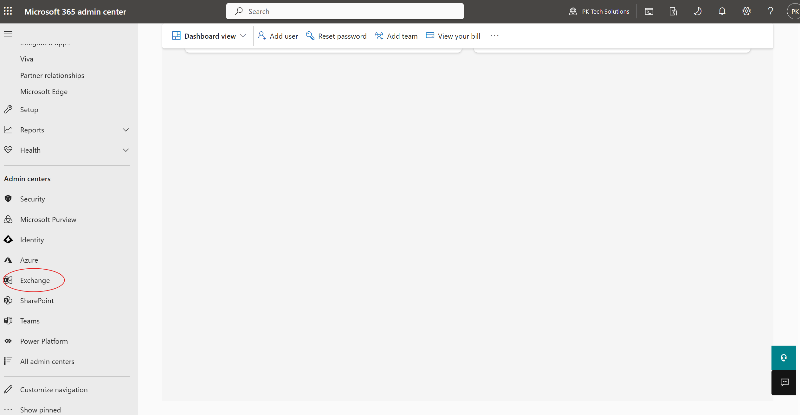
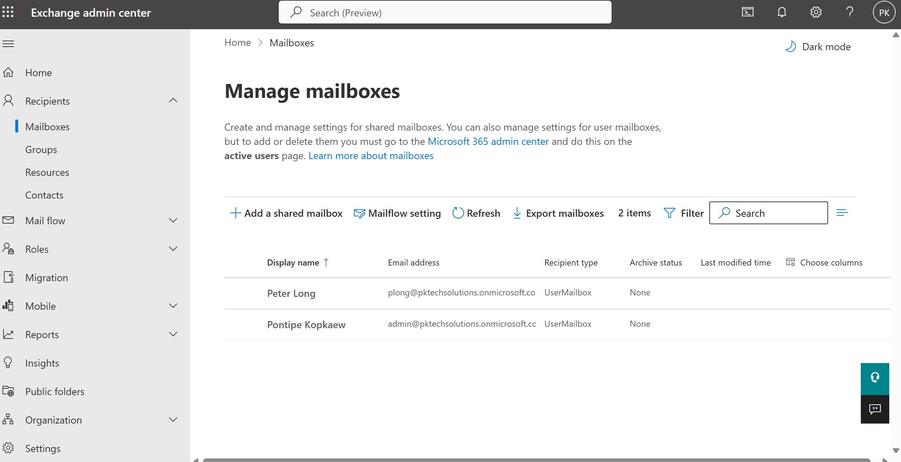
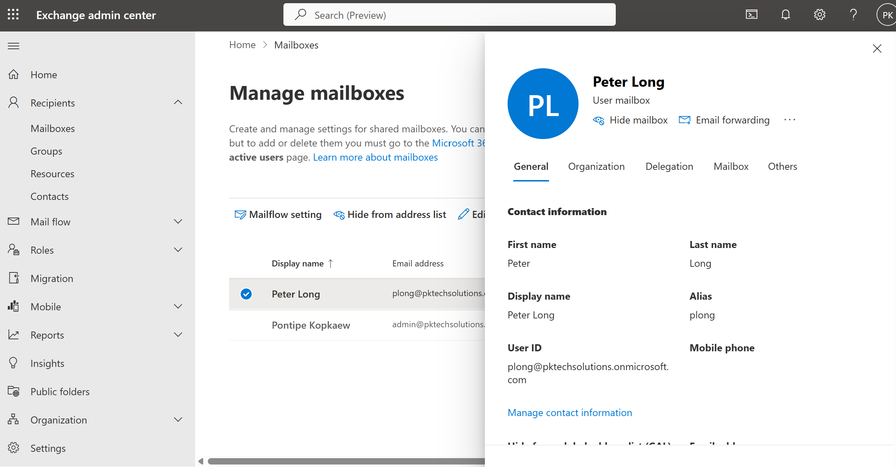

## Task: Access Outlook, OneDrive, and Teams settings from the admin panel

### Goal
Explore the admin-side settings for Outlook, OneDrive, and Teams to understand what IT controls at the organizational level.

### Steps taken
1. Logged into admin.microsoft.com
2. Navigated to Settings > Org settings
3. Located and reviewed Microsoft Teams settings — toggled guest access and external access options
4. Navigated to SharePoint admin center to review OneDrive storage limits and sync settings
5. Navigated to Exchange admin center to review Outlook mailbox settings, including mailbox size limits and shared mailbox options
6. Documented default settings and noted what can be customized per user vs. organization-wide

### Screenshots

  

  

  

  

  

  

  

  

  

### What I learned
Many M365 settings are managed at the organization level, not just per user. Understanding where these controls live in the admin center is essential for IT support. For example, knowing that OneDrive storage is managed through the SharePoint admin center, not the main M365 admin panel.