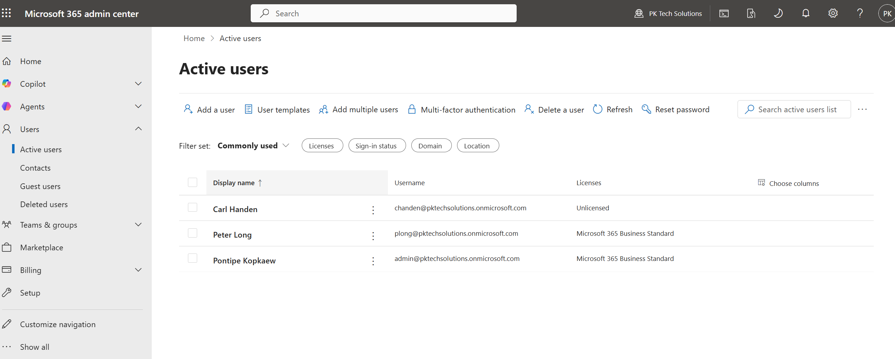
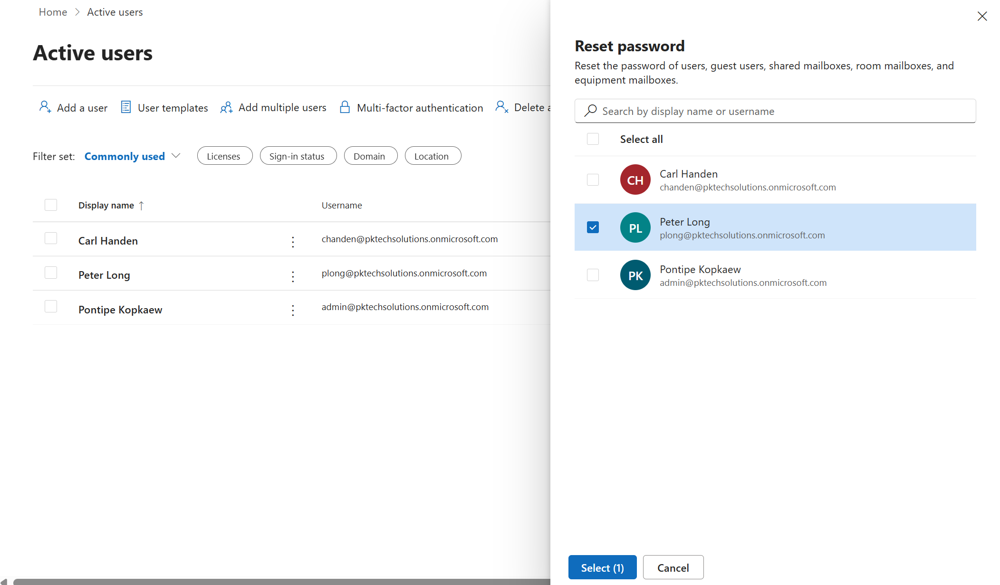
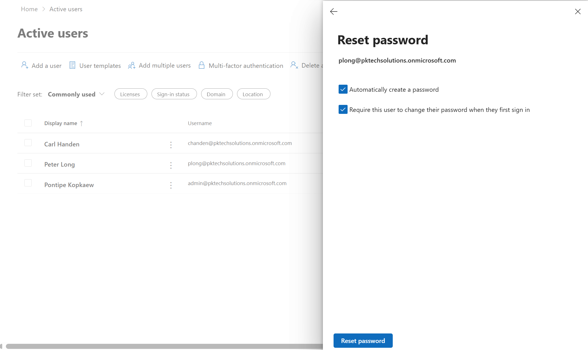
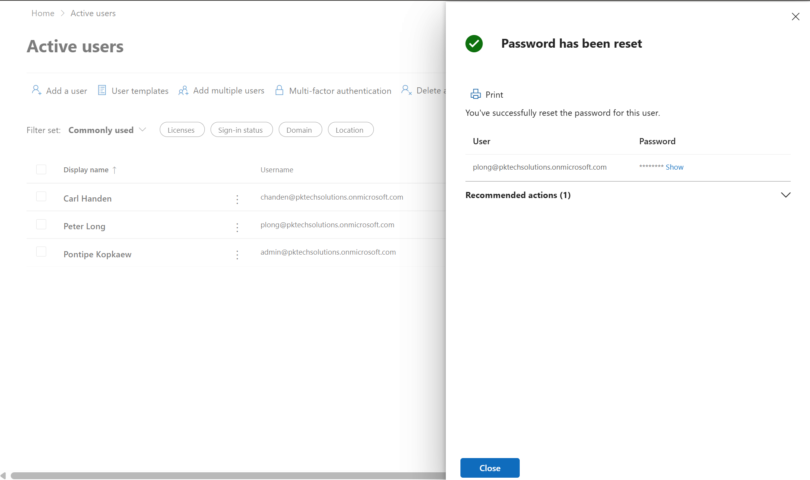

## Task: Reset a user's password

### Goal
Reset a user's password from the M365 Admin Center to simulate a common help desk request.

### Steps taken
1. Logged into admin.microsoft.com
2. Navigated to Users > Active Users
3. Selected user from the user list
4. Clicked Reset password from the user's profile panel
5. Chose Auto-generate password and checked Require this user to change their password at next sign-in
6. Clicked Reset password and saved the temporary password to share with the user

### Screenshots

  

  

  

  

### What I learned
Password resets are one of the most common help desk tickets. Forcing a password change on next sign-in is a security best practice. It ensures only the user knows their final password and reduces the risk of unauthorized access.